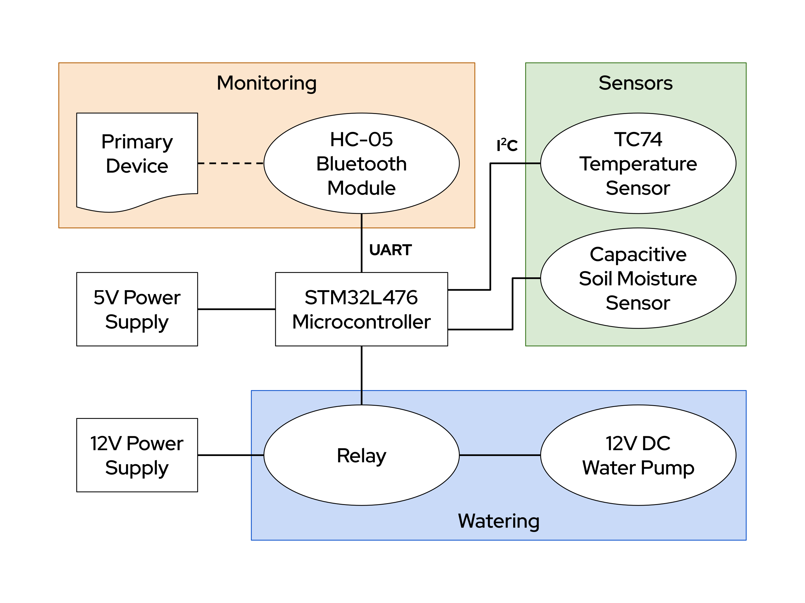

## Overview

Perfect Pot is a plant pot with an integrated watering and monitoring system that will intelligently determine how much and how often to water your plants, saving you time and ensuring optimal plant health. Our system senses the moisture level in the soil and automatically adjusts the watering schedule to suit the needs of the plants. Perfect Pot also recirculates water as it drains. This not only saves water, but also helps to prevent nutrient loss, keeping your plants healthy and happy for longer. It can wirelessly send status updates and notify you when it runs out of water.

## Block Diagram

Learn more about the selected components on our [parts page](https://perfect-pot.github.io/parts.html).
