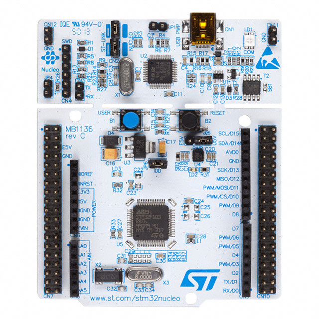
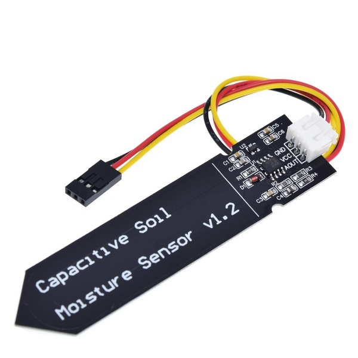
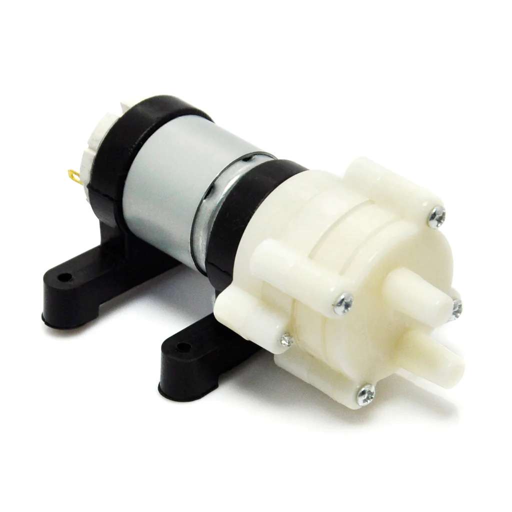
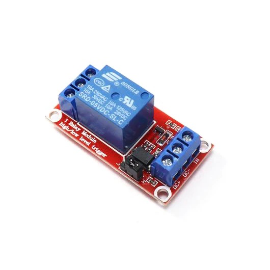
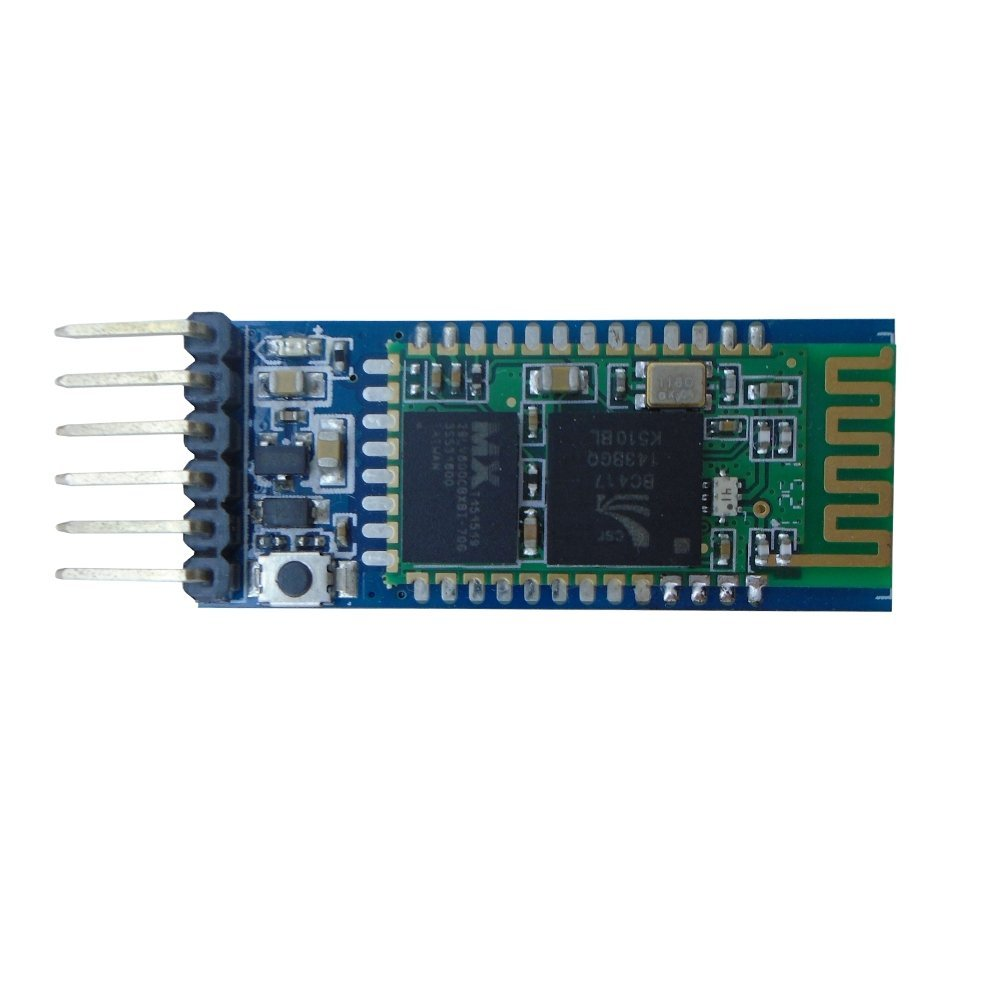
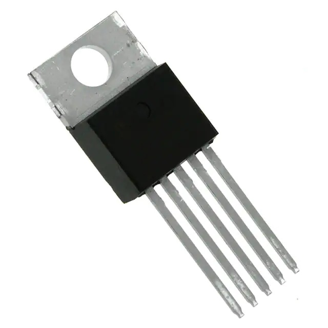

## Nucleo-64 STM32L476RG

We are using the STM32L476 microcontroller for this project, and the prototype unit is built using this Nucleo development board.

## Capacitive Moisture Sensor

The most essential sensor for the project, the large capacitor in the copper layer of this part can be inserted into the soil in the pot and tell how much moisture is present in real time. The sensor outputs an analog signal corresponding to the moisture level of the surrounding soil. A lower voltage indicates more moisture.

## 12V DC Pump

The pump is the main output for the project. When given power, it moves water from the resevoir at the bottom of the pot up to the top of the soil.

## Relay

The relay is used so that the microcontroller can control the DC pump, since it cannot provide the power the pump needs on its own. The relay is simply controlled with a digital signal.

## HC-05 Bluetooth Module

The Bluetooth module provides a way for the project to wireless send information to the user's devices for monitoring and updates. For example, Perfect Pot can send a notification to the user if it detects it is out of water. Communication over Bluetooth uses the UART protocol.

## TC74 Temperature Sensor

The temperature sensor allows Perfect Pot to identify ideal watering times and potentially unsafe conditions for the plant. Data is retreived from this sensor over the I2C protocol.
